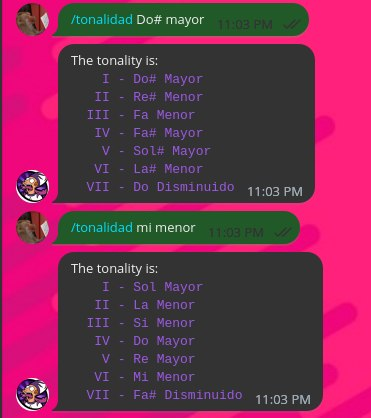

# TonalityBot

[@tonality_bot](https://t.me/tonality_bot)

## Uso

Envía el comando `/tonalidad <nota> <modo>`, por ejemplo:
  - /tonalidad Do# Mayor
  - /tonalidad Re Menor

**IMPORTANTE:** Ten en cuenta que no soy un músico de verdad, solo soy un aficionado y puede haber tonalidades erróneas

# Ejemplo

